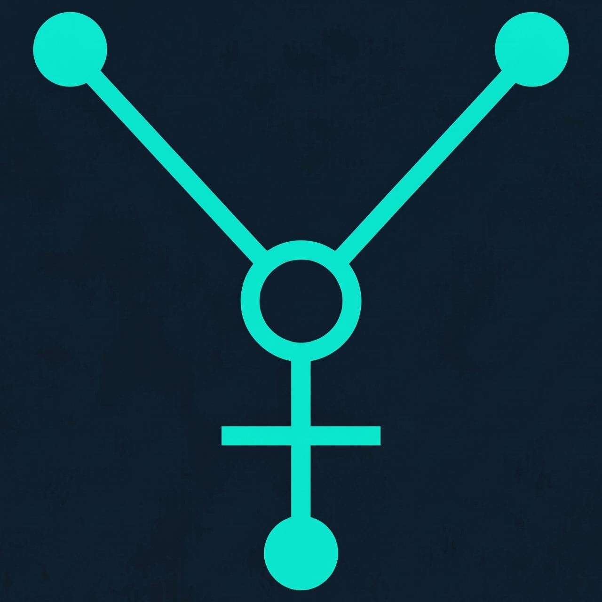

# Tir (تیر) — High-Performance Git GUI Desktop App

[](https://github.com/Ramin1886/Tir_GIT_GUI/actions/workflows/release.yml)
<p align="center">
  
</p>

Tir is a lightweight, responsive, and cross-platform desktop client for Git. Built on **Tauri v2** and **React + TS**, it delivers instant startup times and low memory footprints while providing advanced visual Git porcelain tools.

## 🚀 Key Features

- **Dynamic commit graphs**: Beautiful SVG/Canvas commit history graphs with automatic lane sorting.
- **Line-by-line & Hunk Staging**: Fully interactive staging controls directly within inline and side-by-side diff viewers.
- **In-memory Predictive Conflict Detection**: Anticipate merge conflicts before they happen.
- **Interactive Rebase Editor**: Drag-and-drop or keyboard sorting commits during interactive rebases.
- **Custom Workspaces & Grouping**: Overview active branch, dirty state, and sync counts of multiple repositories at once.
- **Undo operations**: Safely revert accidental Git actions using reflog history.
- **Hosting Integrations**: Local GitHub/GitLab PR lists, head checkouts, and CI/CD status badges.
- **Extensible Diff/Merge Tool Dispatch**: Dispatches to third-party tools (VS Code, Beyond Compare, Vimdiff) using custom config patterns.

---

## 📖 Documentation

Detailed setup guides, workflows, and developer resources are available in the documentation suite:

- **[Tir GUI Documentation Suite](docs/product_documentation.md)**
  - **[User Guide](docs/product_documentation.md#1-user-guide)**: Core staging, merging, stashes, tagging, Git Flow, LFS, and shortcut keys.
  - **[Developer Guide](docs/product_documentation.md#2-developer-guide)**: Code architecture, Rust-to-TypeScript state bridges, and line-by-line patch logic.
  - **[Build & Release Guide](docs/product_documentation.md#3-build--release-workflows)**: Compile requirements, development launch scripts, and CI/CD packaging configurations for Linux, macOS, and Windows.

---

## 🛠️ Tech Stack

- **Backend**: Rust 2021, Tauri v2 framework, safe `git2-rs` bindings.
- **Frontend**: React 19, TypeScript, Zustand (sliced store architecture), Tailwind CSS v4, and CSS Modules.
- **Testing**: Vitest for unit tests, Playwright for E2E integration tests.
- **Design Aesthetic**: Minimalist, flat "Plain Matte" layout inspired by modern development tools. Features a sleek sidebar, subtle grays, and distraction-free typography.

---

## 🚀 CI/CD Release Pipeline & Tagging Pattern

Tir uses **GitHub Actions** for automated releases.
Whenever a new semantic version tag starting with `v` (e.g., `v1.0.0`, `v0.0.3`) is pushed to the repository, the release pipeline automatically compiles and bundles the application for:
- Linux (.AppImage, .deb)
- Windows (.exe, .msi)
- macOS (.dmg, .app)

The bundled installers are then automatically attached to a drafted GitHub Release. 

**Tagging Best Practices**:
- Always use Semantic Versioning (`vMAJOR.MINOR.PATCH`).
- Create and push tags using Git: `git tag v0.0.4 && git push origin v0.0.4`.
- A release draft will automatically appear on GitHub within minutes of pushing the tag.

---

## 🏗️ Quick Start

### Run Dev Server
```bash
npm install
npm run dev
```

### Compile Production Build
```bash
npm run build
npm run tauri build
```

